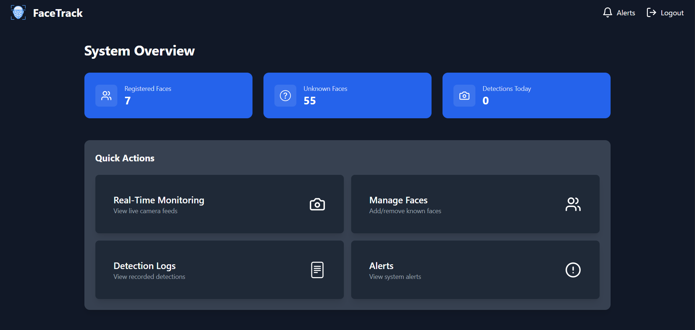
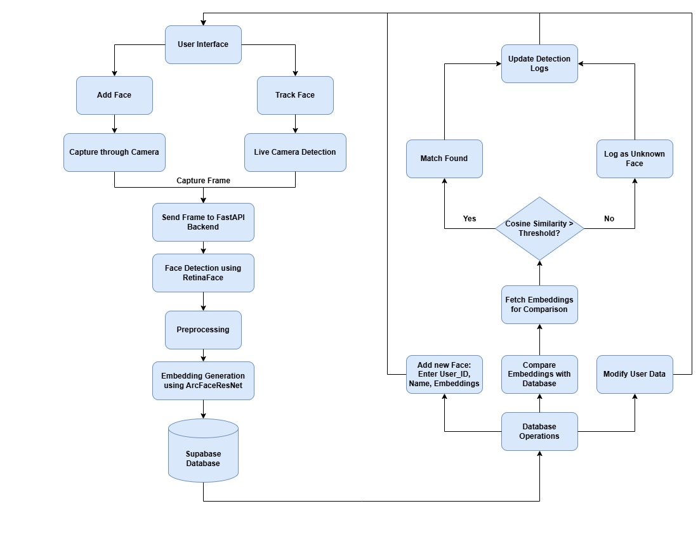

# Face Recognition System 🔍👤

A real-time face recognition system with registration, detection, and analytics capabilities.

[](https://python.org)
[](https://fastapi.tiangolo.com)
[](https://reactjs.org)
[](https://supabase.io)

## System Demo
  
*The main dashboard provides an overview of registered faces, unknown faces, and detections.*

---

  
*System architecture flowchart showing the interaction between components.*

---

## Table of Contents
- [Features](#features-✨)
- [Tech Stack](#tech-stack-🛠️)
- [Installation](#installation-💻)
- [Configuration](#configuration-⚙️)
- [How to Run](#how-to-run-🚀)
- [Hosted Frontend](#hosted-frontend-🌐)
- [License](#license-📜)

---

## Features ✨
- 🎥 Real-time face detection
- 📸 Multi-angle face registration
- 🔍 Unknown face identification
- 📊 Detection analytics dashboard
- 🔐 User management system
- 📈 Confidence-level tracking

---

## Tech Stack 🛠️
**Backend**  
- Python 3.9 | FastAPI | OpenCV | Dlib | insightface  

**Frontend**  
- React 18 | Tailwind CSS | Axios | React Router  

**Database**  
- Supabase (PostgreSQL)  

**Hosting**  
- Render | Vercel | GitHub Actions  

---

## Installation 💻
### Prerequisites
- Python 3.9+
- Node.js 16+
- PostgreSQL
- Supabase Account

---

## Configuration ⚙️
### Setting up the `.env` file
Copy `.env.example` to `.env` in the repository root, then replace the placeholder values:
```env
VITE_BACKEND_URL=http://127.0.0.1:8000

VITE_SUPABASE_URL=your_supabase_url
VITE_SUPABASE_KEY=your_supabase_key
VITE_SUPABASE_DATABASE_URL=your_database_url

USER=postgres
PASSWORD=your_password
HOST=your_host
PORT=5432
DBNAME=postgres
```

Replace the placeholder URLs, key, password, and host with your own configuration. Keep the populated `.env` out of Git.

---

## How to Run 🚀
### 1. Create a virtual environment
```bash
python -m venv venv
source venv/bin/activate  # Linux/Mac
.\venv\Scripts\activate  # Windows
```

### 2. Install dependencies
```bash
pip install -r requirements.txt
```

### 3. Start the backend server
```bash
cd backend
uvicorn app.main:app --reload
```

### 4. Start the frontend app
```bash
cd ..
npm install
npm run dev
```

---

## Hosted Frontend 🌐
Access the hosted frontend application here: [Live Demo](https://facetrack-dbit.vercel.app/)

#### Login Credentials
```
Email : admin@test.com
Password : pass

```

---

## License 📜
This project is licensed under the MIT License. See the [LICENSE](LICENSE) file for details.
